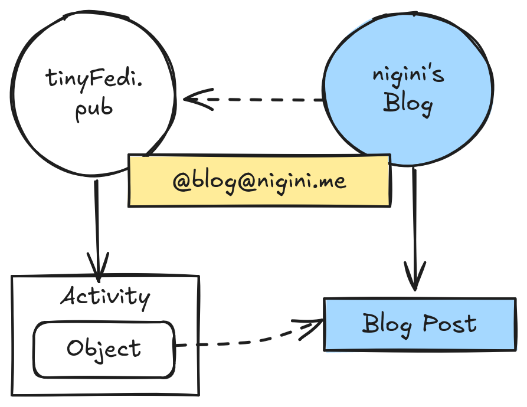

# tinyFedi

A minimalist ActivityPub server designed for easy integration with personal websites.

## Overview

Simple file-based ActivityPub implementation that serves federated content 
from static JSON files. Perfect for personal blogs and small websites 
wanting to join the fediverse without a complex infrastructure.

<div style="text-align:center">
    
</div>

## Tech Stack

- **Python 3.11+** - Required for modern datetime handling
- **Flask** - Lightweight web framework
- **Jinja2** - Template engine for ActivityPub entities
- **File-based storage** - All content served from static JSON files
- **Zero dependencies** - Minimal external requirements

**If you want to know more about how I implemented this software, and learn
a lot about ActivityPub in the process, here are the posts (*you can also Follow 
all updates at @blog@nigini.me - which is using this exact software to Federate):***

1. [Building tinyFedi - part 1](https://nigini.me/blog/3-fediverse_server_part1):
   Here we explore the basics of AP and build around Actors and its Outbox.
2. [Building tinyFedi - part 2](https://nigini.me/blog/4-fediverse_server_part2):
   We finish the basics by building around the Inbox and Activity delivery.
3. Building tinyFedi - part 3: *coming soon* HTTP Signatures
4. Building tinyFedi - part 4: *coming soon* Update, Like, and Annouce
   Activities.

## Setup

### 1. Generate Cryptographic Keys

ActivityPub requires public/private key pairs for secure federation:

```bash
mkdir keys
openssl genrsa -out keys/private_key.pem 2048
openssl rsa -in keys/private_key.pem -pubout -out keys/public_key.pem
```

**Security Note:** Keys are automatically excluded from version control via `.gitignore`.

### 2. Configuration

Copy the example configuration file and customize it for your setup:

```bash
cp config.json.example config.json
```

**!!!** Actor's profile auto-generates from config on startup

### 3. Take it for a Ride

```bash
python app.py
```

Add posts using the CLI:

```bash
./client/new_post.py --title "Post Title" --content "Content" --url "https://yourblog.com/post"
```
**Note:** New posts are automatically delivered to followers when created.

Edit existing posts:

```bash
./client/edit_post.py --post-id "20250101-120000-my-post"
```
**Note:** Updated posts are automatically delivered to followers when edited.

Process incoming activities: 

```bash
python activity_processor.py` #or set up as a cron job
```
**Note:** Activities received in the inbox are automatically queued to be 
processed! 


## Deployment

Designed to run behind a reverse proxy alongside existing websites:

```nginx
location /activitypub/ {
    proxy_pass http://localhost:5000/activitypub/;
}
```

## Development

### Running Tests

Install dependencies and run the test suite:

```bash
pip install -r requirements.txt
python -m pytest tests/ -v
```

### Writing Tests

This project uses a comprehensive test isolation strategy to ensure reliable testing. All test classes should inherit from `TestConfigMixin` for proper test isolation.

**Key principles:**
- Each test gets its own temporary directory and configuration
- Module reload prevents global variable caching issues
- Configuration-driven paths (no hardcoded references)
- Import app modules INSIDE test methods, AFTER `setUp()` runs

**See `tests/test_config.py`** for complete documentation, usage patterns, helper methods, and implementation details of the test configuration strategy.

## Template System

ActivityPub entities are generated using Jinja2 templates for maintainability and extensibility:

```
templates/
├── objects/          # ActivityStreams Object types
│   ├── actor.json.j2      # Person/Service actors
│   ├── article.json.j2    # Blog posts, articles
│   └── note.json.j2       # Short messages (future)
├── activities/       # ActivityStreams Activity types
│   ├── create.json.j2     # Create activities
│   └── update.json.j2     # Update activities (future)
└── collections/      # ActivityStreams Collections
    ├── outbox.json.j2     # Outbox collections
    └── followers.json.j2  # Followers collections
```

**Design Philosophy:**
- **Type-specific templates** - Each ActivityStreams type has its own template
- **Extensible** - Easy to add new object types (Note, Image, Event) and activity types (Like, Follow, Announce)
- **Spec-compliant** - Templates ensure proper ActivityPub/ActivityStreams structure
- **Configurable** - All values injected from `config.json` and runtime data


## Federation Features

**Implemented:**
- **WebFinger Discovery** - `.well-known/webfinger` for actor discovery
- **Actor Profile** - Dynamic actor generation from config
- **Outbox Collection** - Serves all published activities
- **Individual Endpoints** - Posts and activities accessible via direct URLs
- **Inbox Endpoint** - Receives activities from other federated servers with HTTP signature verification
- **Followers Collection** - Manages and serves follower list
- **Content Negotiation** - Proper ActivityPub headers and validation
- **HTTP Signature Verification** - Cryptographic validation of incoming activities (configurable)
- **HTTP Signature Signing** - Sign outgoing activities for secure delivery

**File Structure:**
```
static/
├── actor.json           # Your actor profile (auto-generated)
├── outbox.json          # Collection of your activities (auto-generated)
├── followers.json       # Collection of followers (auto-generated)
├── posts/               # Individual post objects
│   └── 20250921-143022-my-post.json
├── activities/          # Individual activity objects
│   └── create-20250921-143022.json
└── inbox/               # Received activities from other servers
    ├── TO_DO.json       # Queue of activities needing processing
    ├── follow-*.json    # Follow requests received
    └── undo-*.json      # Unfollow activities received
```

**Current Capabilities:**
- ✅ Others can discover your actor via WebFinger
- ✅ Others can follow your actor and read your posts
- ✅ You receive and process all incoming activities
- ✅ Automatic follower management (add/remove followers)
- ✅ Auto-respond to Follow requests with Accept activities
- ✅ Deliver new posts to all followers automatically
- ✅ HTTP signature verification for incoming activities (configurable)
- ✅ HTTP signature signing for all outgoing deliveries

**Configuration Options:**
- `auto_accept_follow_requests` - Automatically accept follow requests (default: true). Set to `false` for manual approval of followers
- `require_http_signatures` - Require HTTP signatures on all incoming activities (default: false). Set to `true` for production to reject unsigned server-to-server traffic

## What's Next

**Recommended Improvements:**
- **Proper logging system** - Replace print() statements with Python's logging module
- **Activity ID naming improvements** - Fix timestamp conflicts by implementing Content-Addressable Storage (CAS) approach using content hashes instead of timestamps
- **Outbox folder organization** - Create dedicated outbox directory structure mirroring inbox organization for better file management
- **Deprecation fixes** - Replace datetime.utcnow() with datetime.now(datetime.UTC) for Python 3.12+

**Future Enhancements:**
- **Update Activity Support** - Enable post editing with federated notifications
  ```json
  {
    "@context": "https://www.w3.org/ns/activitystreams",
    "type": "Update",
    "id": "https://yourblog.com/activities/update-abc123",
    "actor": "https://yourblog.com/activitypub/actor",
    "published": "2025-01-19T12:34:56Z",
    "object": {
      "type": "Article",
      "id": "https://yourblog.com/activitypub/posts/20250921-143022-my-post",
      "attributedTo": "https://yourblog.com/activitypub/actor",
      "published": "2025-09-21T14:30:22Z",
      "updated": "2025-01-19T12:34:56Z",
      "name": "Updated Title",
      "content": "Updated content..."
    }
  }
  ```
  Key properties: `object.id` must match original post ID; `object` contains complete updated version; `object.updated` timestamp required. Implementation note: `edit_post.py` should accept only `--post-id`, then interactively prompt for each updatable field (title, content, summary, url) showing current values, allowing the user to make changes iteratively until confirming they're done.

- **Like Activity Support** - Track post engagement with likes collection
  ```json
  {
    "@context": "https://www.w3.org/ns/activitystreams",
    "type": "Like",
    "id": "https://mastodon.social/users/alice/statuses/123456/activity",
    "actor": "https://mastodon.social/users/alice",
    "object": "https://yourblog.com/activitypub/posts/20250921-143022-my-post"
  }
  ```
  Key properties: `actor` identifies who liked; `object` references the post being liked. Implementation: Process incoming Like activities, maintain per-post likes collection at `/posts/{id}/likes` endpoint, add `likes` property to post objects pointing to collection, handle `Undo(Like)` for unlikes. See [ActivityPub §5.7](https://www.w3.org/TR/activitypub/#likes).

- **Announce Activity Support** - Track post shares/boosts collection
  ```json
  {
    "@context": "https://www.w3.org/ns/activitystreams",
    "type": "Announce",
    "id": "https://mastodon.social/users/bob/statuses/789012/activity",
    "actor": "https://mastodon.social/users/bob",
    "object": "https://yourblog.com/activitypub/posts/20250921-143022-my-post",
    "published": "2025-01-19T15:30:00Z"
  }
  ```
  Key properties: `actor` identifies who shared; `object` references the post being announced. Implementation: Process incoming Announce activities, maintain per-post shares collection at `/posts/{id}/shares` endpoint, add `shares` property to post objects pointing to collection, handle `Undo(Announce)` for unshares. See [ActivityPub §5.8](https://www.w3.org/TR/activitypub/#shares).

- **Delete Activity Support** - Remove posts from federation with tombstoning
  ```json
  {
    "@context": "https://www.w3.org/ns/activitystreams",
    "type": "Delete",
    "id": "https://yourblog.com/activities/delete-abc123",
    "actor": "https://yourblog.com/activitypub/actor",
    "object": "https://yourblog.com/activitypub/posts/20250921-143022-my-post",
    "published": "2025-01-19T16:00:00Z"
  }
  ```
  Key properties: `actor` is the deleter; `object` references the post being deleted. Implementation: `delete_post.py` CLI replaces post file with Tombstone object (preserves references in conversations), creates Delete activity, delivers to all followers. Tombstone includes `deleted` timestamp and returns 200 OK instead of 410 Gone to maintain conversation integrity. See [ActivityPub §6.11](https://www.w3.org/TR/activitypub/#delete-activity-outbox).

- Manual follow approval workflow
- Mention and reply handling
- Clients endpoints

## To Consider

### Client-to-Server (C2S) Protocol and Mastodon API Compatibility

**Current Implementation:** tinyFedi implements only the Server-to-Server (S2S) protocol for federation. Content creation and editing happens via CLI tools (`client/new_post.py`, `client/edit_post.py`), which is ideal for blog use cases.

**The C2S vs Mastodon API Debate:** The ActivityPub specification includes a Client-to-Server (C2S) protocol, but it has seen almost no real-world adoption. Mastodon rejected C2S support in 2019, arguing the spec was too barebones (lacking notifications, search, autocomplete, blocking, muting) and would require so much custom vocabulary that "you might as well just use the Mastodon REST API." Instead, Mastodon's proprietary API became the de facto standard, with other platforms (Pleroma, Misskey) implementing Mastodon API compatibility rather than C2S.

| Aspect | ActivityPub C2S | Mastodon API |
|--------|----------------|--------------|
| **Philosophy** | Protocol-first, thin server | Feature-rich, thick server |
| **Scope** | Minimal (POST activities, GET collections) | Comprehensive (notifications, search, filters, muting, blocking) |
| **Interoperability** | Works across any C2S implementation | Mastodon-specific (but copied by others) |
| **Adoption** | Almost none | Universal in Fediverse |

**Third-Party Client Support:** Popular Fediverse clients (Tusky, Ivory, Mast, Elk) expect Mastodon API compatibility, which requires: (1) OAuth 2.0 authentication flow with `/oauth/authorize` and `/oauth/token` endpoints, (2) Mastodon-compatible API endpoints like `/api/v1/statuses`, and (3) specific OAuth scopes (`read`, `write`, `follow`). The ActivityPub Client-to-Server protocol alone is insufficient - clients expect the full Mastodon API surface.

**Alternative Approaches:** Simple authentication methods (Bearer tokens, HTTP Basic Auth) would enable custom web interfaces or curl-based posting but won't work with existing mobile apps. Implementing full Mastodon API compatibility is a significant undertaking that essentially requires reimplementing Mastodon's client-facing layer.

### Linked Data Signatures vs HTTP Signatures

**Current Implementation:** HTTP Signatures (transport-layer, header-based)

The fediverse currently uses **HTTP Signatures** (draft-cavage-http-signatures-12) which sign the HTTP request itself. The signature lives in the `Signature` header, and the activity JSON body remains clean without embedded signatures.

**Alternative Approach:** Linked Data Signatures (object-layer, embedded)

**Linked Data Signatures** embed cryptographic signatures directly in the ActivityPub JSON document:

```json
{
  "type": "Follow",
  "actor": "https://example.com/users/alice",
  "object": "https://yourserver.com/actor",
  "signature": {
    "type": "RsaSignature2017",
    "creator": "https://example.com/users/alice#main-key",
    "created": "2025-01-05T12:00:00Z",
    "signatureValue": "base64encodedstuff=="
  }
}
```

**Potential Advantages:**
- **Persistence:** Signature travels with the activity when stored/forwarded
- **Verification without transport:** Can verify authenticity of stored activities later
- **Migration scenarios:** Verify integrity and authorship of archived activities
- **Multi-hop federation:** Original signature preserved through forwarding

**Why Not Implemented:**
- More complex (requires JSON-LD canonicalization)
- Mostly deprecated in modern fediverse (Mastodon, Pleroma use HTTP signatures)
- HTTP signatures are simpler and cover the same security requirements for real-time federation
