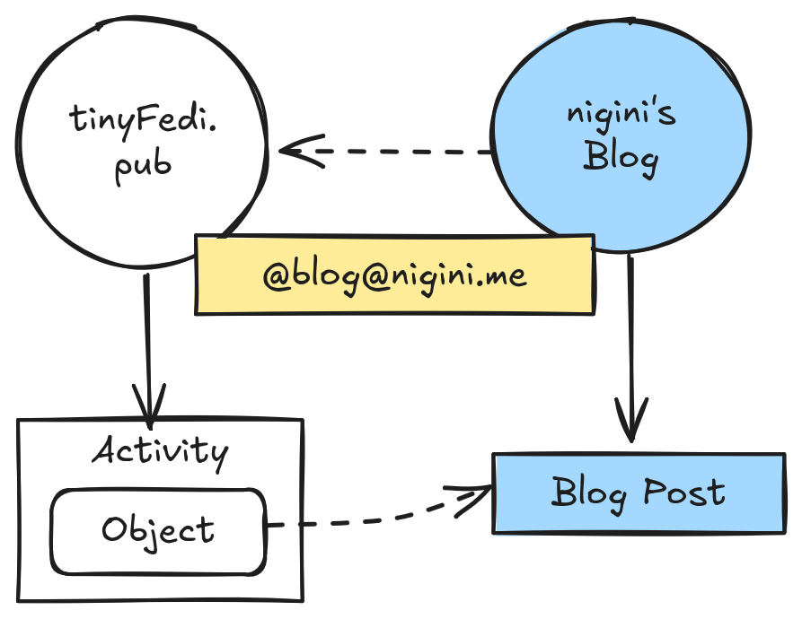

# tinyFedi

A minimalist ActivityPub server designed for easy integration with personal websites.

## Overview

Simple file-based ActivityPub implementation that serves federated content 
from static JSON files. Perfect for personal blogs and small websites 
wanting to join the fediverse without a complex infrastructure.

<div style="text-align:center">
    
</div>

## Tech Stack

- **Python 3.11+** - Required for modern datetime handling
- **Flask** - Lightweight web framework
- **Jinja2** - Template engine for ActivityPub entities
- **File-based storage** - All content served from static JSON files
- **Zero dependencies** - Minimal external requirements

**If you want to know more about how I implemented this software, and learn
a lot about ActivityPub in the process, here are the posts (*you can also Follow 
all updates at @blog@nigini.me - which is using this exact software to Federate):***

1. [Building tinyFedi - part 1](https://nigini.me/blog/3-fediverse_server_part1):
   Here we explore the basics of AP and build around Actors and its Outbox.
2. [Building tinyFedi - part 2](https://nigini.me/blog/4-fediverse_server_part2):
   We finish the basics by building around the Inbox and Activity delivery.
3. Building tinyFedi - part 3: *coming soon* HTTP Signatures
4. Building tinyFedi - part 4: *coming soon* Update, Like, and Annouce
   Activities.

## Setup

### 1. Generate Cryptographic Keys

ActivityPub requires public/private key pairs for secure federation:

```bash
mkdir keys
openssl genrsa -out keys/private_key.pem 2048
openssl rsa -in keys/private_key.pem -pubout -out keys/public_key.pem
```

**Security Note:** Keys are automatically excluded from version control via `.gitignore`.

### 2. Configuration

Copy the example configuration file and customize it for your setup:

```bash
cp config.json.example config.json
```

**!!!** Actor's profile auto-generates from config on startup

### 3. Take it for a Ride

```bash
python app.py
```

Add posts using the CLI:

```bash
./client/new_post.py --title "Post Title" --content "Content" --url "https://yourblog.com/post"
```
**Note:** New posts are automatically delivered to followers when created.

Edit existing posts:

```bash
./client/edit_post.py --post-id "550e8400-e29b-41d4-a716-446655440000"
```
**Note:** Updated posts are automatically delivered to followers when edited.

Process incoming activities: 

```bash
python -m activity_processor` #or set up as a cron job
```
**Note:** Activities received in the inbox are automatically queued to be 
processed! 


## Deployment

Designed to run behind a reverse proxy alongside existing websites:

```nginx
location /activitypub/ {
    proxy_pass http://localhost:5000/activitypub/;
}
```

## Development

### Running Tests

Install dependencies and run the test suite:

```bash
pip install -r requirements.txt
python -m pytest tests/ -v
```

### Writing Tests

This project uses a comprehensive test isolation strategy to ensure reliable testing. All test classes should inherit from `TestConfigMixin` for proper test isolation.

**Key principles:**
- Each test gets its own temporary directory and configuration
- Module reload prevents global variable caching issues
- Configuration-driven paths (no hardcoded references)
- Import app modules INSIDE test methods, AFTER `setUp()` runs

**See `tests/test_config.py`** for complete documentation, usage patterns, helper methods, and implementation details of the test configuration strategy.

## Template System

ActivityPub entities are generated using Jinja2 templates for maintainability and extensibility:

```
templates/
├── base/             # Shared base templates
│   ├── activity.json.j2   # Base for all activity types
│   └── post.json.j2       # Base for Article/Note
├── objects/          # ActivityStreams Object types
│   ├── actor.json.j2      # Person/Service actors
│   ├── article.json.j2    # Blog posts, articles
│   └── note.json.j2       # Short messages
├── activities/       # ActivityStreams Activity types
│   ├── create.json.j2     # Create activities
│   ├── update.json.j2     # Update activities
│   └── accept.json.j2     # Accept activities (follow responses)
└── collections/      # ActivityStreams Collections
    ├── outbox.json.j2     # Outbox collection (paginated)
    └── followers.json.j2  # Followers collections
```

**Design Philosophy:**
- **Type-specific templates** - Each ActivityStreams type has its own template
- **Extensible** - Easy to add new object types (Note, Image, Event) and activity types (Like, Follow, Announce)
- **Spec-compliant** - Templates ensure proper ActivityPub/ActivityStreams structure
- **Configurable** - All values injected from `config.json` and runtime data


## Federation Features

**Implemented:**
- **WebFinger Discovery** - `.well-known/webfinger` for actor discovery
- **Actor Profile** - Dynamic actor generation from config
- **Outbox Collection** - Dynamically serves published activities with pagination
- **Individual Endpoints** - Posts and activities accessible via direct URLs
- **Inbox Endpoint** - Receives activities from other federated servers with HTTP signature verification
- **Followers Collection** - Manages and serves follower list
- **Content Negotiation** - Proper ActivityPub headers and validation
- **HTTP Signature Verification** - Cryptographic validation of incoming activities (configurable)
- **HTTP Signature Signing** - Sign outgoing activities for secure delivery
- **Likes Collection** - Per-post likes tracking with collection endpoint at `/posts/{id}/likes`
- **C2S Bearer Token Auth** - Token-based authentication for client-to-server endpoints
- **C2S Outbox POST** - Clients submit AS2 objects, server wraps in Create activity and delivers
- **Streams/Posts** - Object-centric paginated collection of posts (not activities) with inline reaction summaries
- **Actor Streams Discovery** - Actor profile includes `streams` array for client discovery

**File Structure:**
```
data/
├── actor.json           # Your actor profile (auto-generated)
├── followers.json       # Collection of followers (auto-generated)
├── posts/               # Individual post objects (UUID directories)
│   └── {uuid}/
│       ├── post.json       # Post object with inline reaction summaries
│       ├── likes.json      # OrderedCollection of actors who liked
│       ├── shares.json     # OrderedCollection of actors who shared
│       └── replies.json    # OrderedCollection of replies
├── outbox/              # Outgoing activity objects
│   └── create-20250921-143022-123456.json
└── inbox/               # Received activities from other servers
    ├── follow-*.json    # Follow requests received
    ├── undo-*.json      # Unfollow activities received
    └── queue/           # Symlinks to activities awaiting processing
```

**Current Capabilities:**
- ✅ Others can discover your actor via WebFinger
- ✅ Others can follow your actor and read your posts
- ✅ You receive and process all incoming activities
- ✅ Automatic follower management (add/remove followers)
- ✅ Auto-respond to Follow requests with Accept activities
- ✅ Deliver new posts to all followers automatically
- ✅ HTTP signature verification for incoming activities (configurable)
- ✅ HTTP signature signing for all outgoing deliveries
- ✅ Receive and track Like activities per post

**Configuration Options:**
- `auto_accept_follow_requests` - Automatically accept follow requests (default: true). Set to `false` for manual approval of followers
- `require_http_signatures` - Require HTTP signatures on all incoming activities (default: false). Set to `true` for production to reject unsigned server-to-server traffic
- `max_page_size` - Maximum items per page for paginated collections like outbox (default: 20). Clients can request smaller pages via `?limit=N`

## What's Next

**Architecture:**
- **Outbox queue processing** — Move outbox delivery into the queue system so CLI tools just create + queue activities, and the processor handles delivery (with retry on failure)
- **Integrate delivery into processors** — Move `activity_delivery.py` into the `activity_processor` module as `delivery.py`, since delivery is outbox processing
- **Per-follower delivery tracking** — Expand the queue to track delivery per-follower, enabling independent retries for failed deliveries

**Activity Types:**
- **Announce** — Per-post shares collection at `/posts/{id}/shares`, with `Undo(Announce)`. See [AP §5.8](https://www.w3.org/TR/activitypub/#shares)
- **Delete** — Tombstoning posts + federated Delete delivery. See [AP §6.11](https://www.w3.org/TR/activitypub/#delete-activity-outbox)
- **EmojiReact** — Rich reactions per [FEP-c0e0](https://codeberg.org/fediverse/fep/src/branch/main/fep/c0e0/fep-c0e0.md)

**Client-to-Server:**
- **Following** — Send Follow activities, maintain `following.json`, handle Accept/Reject
- **Inbox materialization** — `streams/home` with objects from followed actors
- **Microsyntax processing** — Server-side `@mention` / `#hashtag` / URL resolution on outbox POST
- **Object Integrity Proofs** — Self-authenticating posts via [FEP-8fcf](https://codeberg.org/fediverse/fep), embedding cryptographic signatures in objects (like Nostr's `sig`)

**Other:**
- Proper logging system (replace `print()` with Python's `logging` module)
- Manual follow approval workflow
- Mention and reply handling

## Design Notes

See `docs/` for detailed design documents:
- `docs/CLIENT_CONTRACT.md` — What tinyFedi guarantees to clients (normalization, streams, auth)
- `docs/AP_Federation/SignaturesFlows.md` — HTTP signature flows
